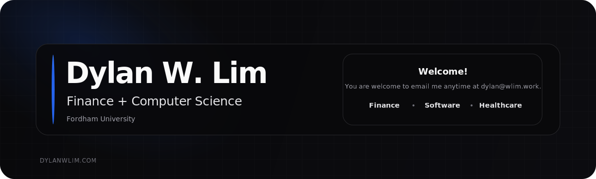
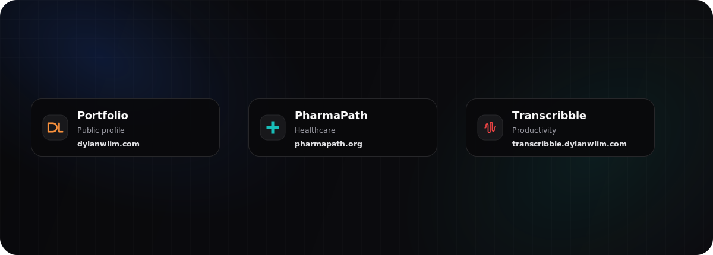

  

  <a href="https://dylanwlim.com">Website</a>
  ·
  <a href="https://www.linkedin.com/in/dylanwlim/">LinkedIn</a>
  ·
  <a href="mailto:dylan@wlim.work">Email</a>

## Current Focus

- Studying Finance and Computer Science at Fordham University.
- Working on tools and building compute for bioinformatics. My work can be found [here](https://dylanwlim.com/).

## Selected Work

Below are some of my personal favorite products I have released:

  

| Product | Public Surface | Scope |
| --- | --- | --- |
| Portfolio | [Link](https://dylanwlim.com) · [Docs](https://github.com/dylanwlim/portfolio-docs) | Personal site, project map, public profile |
| PharmaPath | [Link](https://pharmapath.org) · [Docs](https://github.com/dylanwlim/pharmapath-docs) | Medication and pharmacy-pathway tool |
| Transcribble | [Link](https://transcribble.dylanwlim.com) · [Docs](https://github.com/dylanwlim/transcribble-docs) | File transcription, decoding, and conversion workflows |

## Contact

For work, collaboration, or general conversations:

- Website: [dylanwlim.com](https://dylanwlim.com)
- LinkedIn: [linkedin.com/in/dylanwlim](https://www.linkedin.com/in/dylanwlim/)
- Email: [dylan@wlim.work](mailto:dylan@wlim.work)
